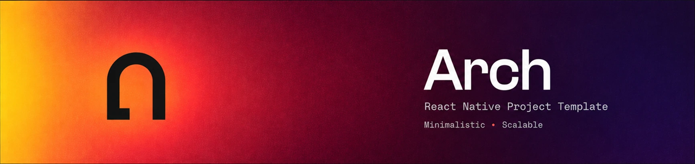

<div align="center">
  <h1 align="center">Arch</h1>
  <h3 align="center">A React Native Project Template</h3>
  <h6 align="center">Minimalistic • Scalable</h3>
</div>

<div align="center">
  <a href="https://ko-fi.com/michmadheo" target="_blank">
    
  </a>
</div>

## Quick Start 🎮

In your new project folder:

```bash
git clone https://github.com/ArchPeople/react_native_project_template_arch.git
```

Or download via [releases](https://github.com/ArchPeople/react_native_project_template_arch/releases).

## Requirements 🛠️

These are the requirements to run this template:

- Java minimum version 17
- Node version >= 24.3.0
- yarn version 1.22.22
- Android Studio minimum version Meerkat 2024.3.1
- Xcode up minimum version 16.4

> [!NOTE]
> Requirements doesn't match your setup? find another template version in [releases](https://github.com/ArchPeople/react_native_project_template_arch/releases).

## What's included 🚀

Essentials To ease your project setup. Here you can find:

- ✅ React Native 0.87.1, up-to-date with the latest [react-native](https://www.npmjs.com/package/react-native) version
- ✅ Tasty ready-to-use flavors, configured for development, staging & production environment (See [how to run](guide/how-to-run.md) guide)
- ✅ Ready to use icons from [material icons](https://www.npmjs.com/package/@react-native-vector-icons/material-icons)
- ✅ Consistent template for new feature with [plop.js](https://www.npmjs.com/package/plop)
- ✅ Hello! Bonjour! localization support with [i18Next](https://github.com/i18next/i18next)
- ✅ The one and only navigation system with [react-navigation](https://www.npmjs.com/package/@react-navigation/native)
- ✅ Robust API Fetching with [axios](https://www.npmjs.com/package/axios)
- ✅ Easy to use [redux-toolkit](https://www.npmjs.com/package/@reduxjs/toolkit) design pattern (see [demo-feature](src/features/demo-feature) for example)
- ✅ Super fast key-value storage with [react-native-mmkv](https://github.com/mrousavy/react-native-mmkv)
- ✅ Assortment of ready-to-use themes for styling (see [themes](src/app/themes) for example)
- ✅ Helpful utilities and extensions (see [general-helpers](src/core/general-helpers) for example)
- ✅ Structured atomic design pattern for components (see [components](src/app/components) for example)
- ✅ Everyone's favorite dark mode, is supported (see [useSystemMode](src/core/hooks/system-mode/useSystemMode.ts) hooks for usage)

Check the [package.json](package.json) for packages versions.

> [!TIP]
> Didn't like what's included? want to swap packages? feel free to do it!

## Get Started 📦

After cloning or downloading the project to your project folder, please run:

```bash
yarn run arch:init
```

<p align="center">
  
</p>

Follow the prompts and instructions, then everything is ready 🚀

Run the app:

```bash
yarn run android:dev
```

or

```bash
yarn run ios:dev
```

> [!IMPORTANT]
> Make sure that .env file exist in root project, for more info please read [how to run](guide/how-to-run.md) guide

## Guidance library 📚

For more guidance, please check the [guide](guide) folder

> [!IMPORTANT]
> Once you are ready to build the app, if you're using generated environment don't forget to delete the .env file after you've generated the config. Else, your .env file's contents will be shown if the app is being decompiled

## License

[MIT](LICENSE)
